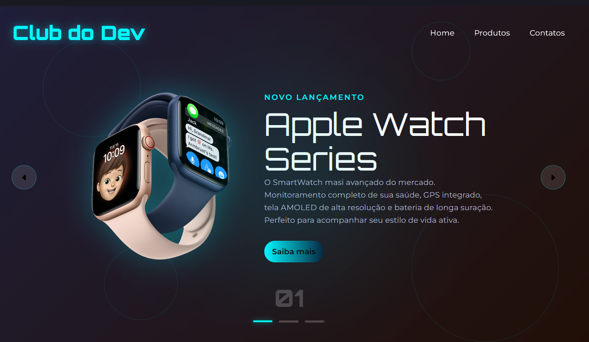

# 🎲 Projeto: Club do Dev 

**Desenvolvido por:** Dev Eduardo José Marinho  

## 🚀 Tecnologias Utilizadas
- HTML semântico
- CSS avançado (animações e responsividade)
- JavaScript intermediário (dinamismo e interações)

## 🎯 Descrição
Projeto prático e desafiador que une a estruturação HTML e animações em CSS com lógica JavaScript. 

- Animações dinâmicas na interface. 🎨
- Layout responsivo, adaptado 📱💻

## 📚 Processo
Este projeto foi concluído com esforço, dedicação e pesquisa. Cada funcionalidade foi criada com atenção aos detalhes, aprendendo ainda mais com cada erro e tentativa.

## 🖼️ Visual do Projeto
Você pode visualizar o funcionamento .

> “Construir, errar, refatorar, aprender: esse é o caminho do Dev.” – Edu Marinho.
